# Alertas de e-mail con SNS para los diferentes estados de los jobs de AWS Backups

Se accede al servicio ``AWS Backups > Backups plans > Create Backup plan`` y se crea un plan de copias de seguridad 

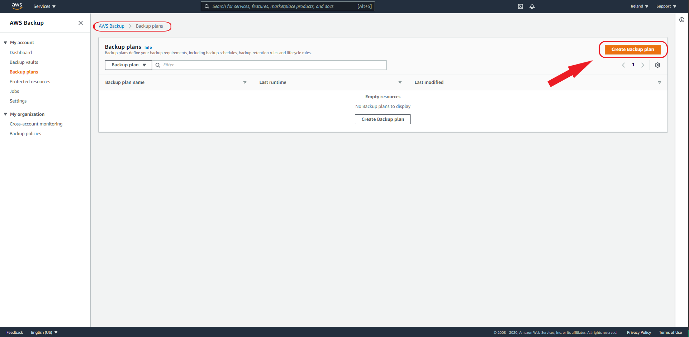

Se elige la opción `Build a new plan` y se asigna un nombre. 

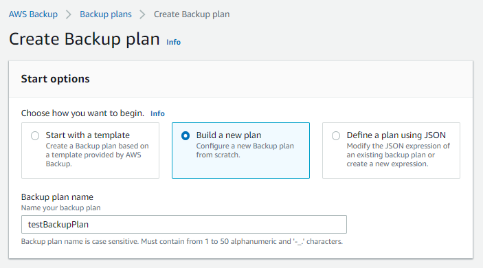

En la misma página en la parte inferior, se va a configurar el `Backup rule`. Las reglas de las copias de seguridad es para indicar cada cuanto tiempo hay que realizar las copias de seguridad.

Se le asigna un nombre y se define la regla de respaldo con ``backup schedule``, ``backup window`` y ``lifecycle rules``.

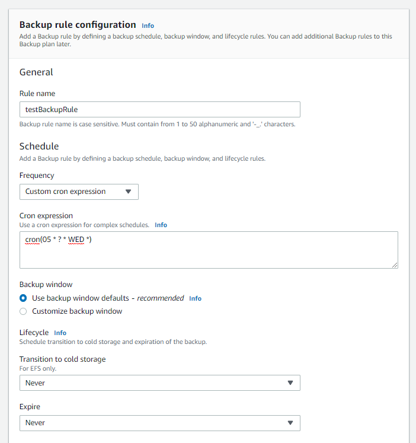

Se deja el `Backup Vault` por defecto y creamos el plan.

Lo siguiente es añadir los recursos que se quiera realizar la zopia de seguridad. Para esto en se accede a `AWS Backup > Backup plans > testBackupPlan > Assign resources`.

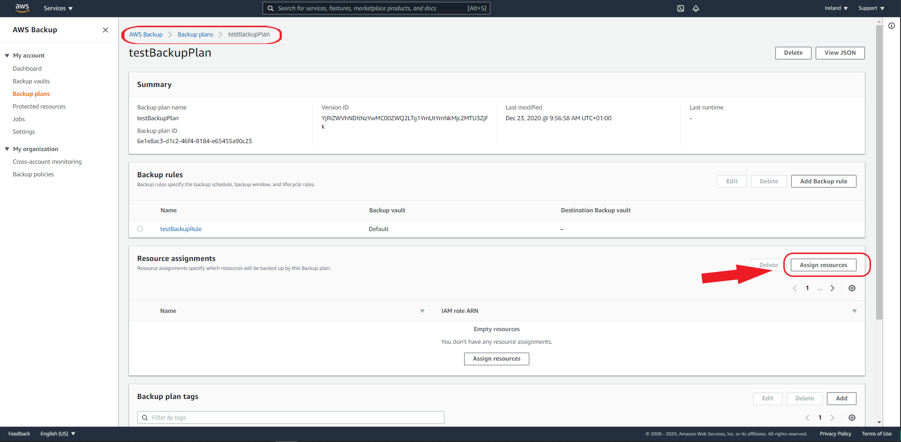

Se le asigna el nombre y en `Assign by` se elige `Resource ID`, el tipo de recurso y el id del recurso.

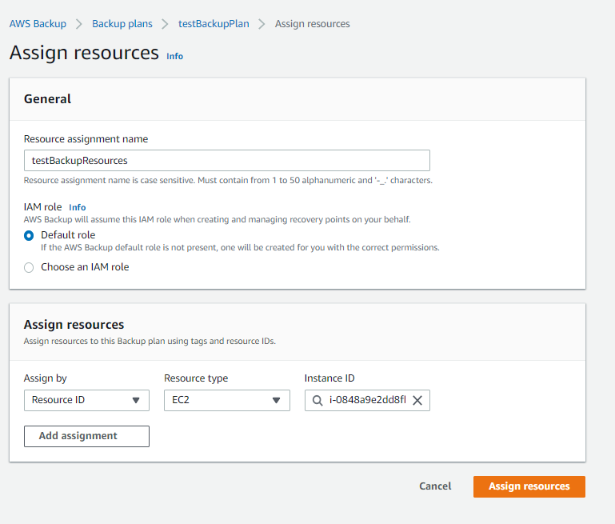

Ahora se va a crear un `Topics` con el servicio de ***SNS**. Se accede a `Amazon SNS > Topics > Create topics` 

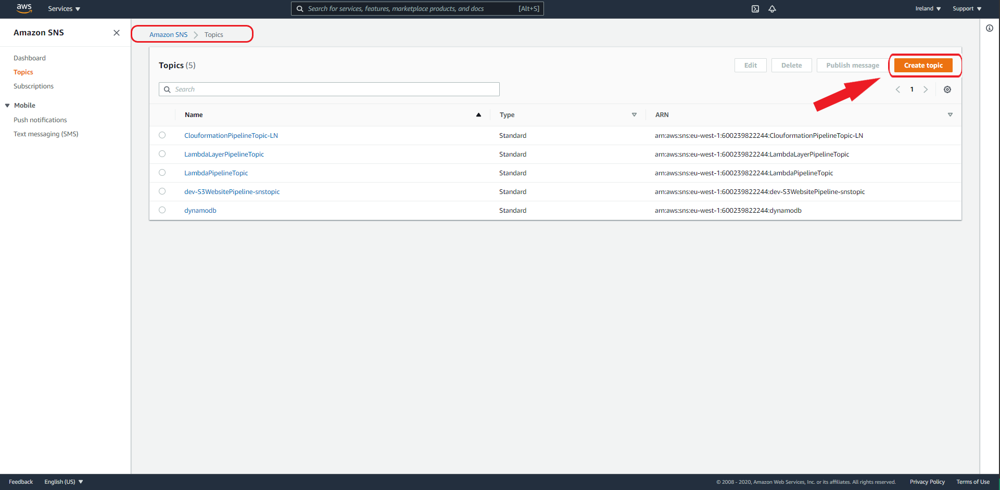

Se asigna el nombre del topic y el tipo ``Standard``.

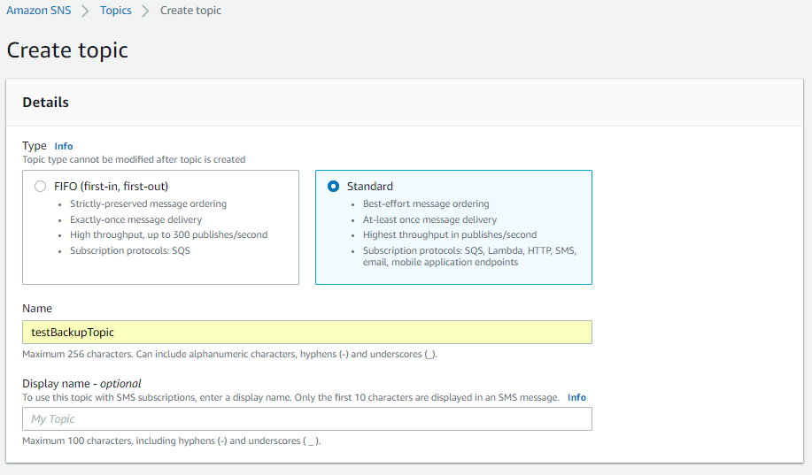

Se añade una política de acceso:

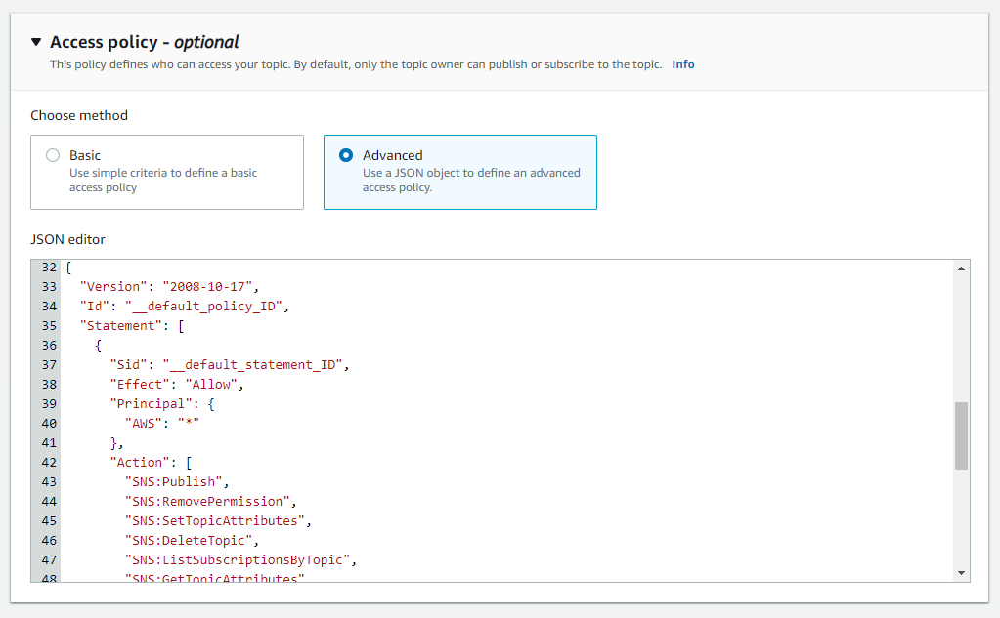

Hay que añadir el arn del topic creado anteriormente y la id del propietario. Esta id se puede conseguir en `Amazon SNS > Topics > testBackupTopic`.

El código es el siguiente:
~~~~
{
  "Version": "2008-10-17",
  "Id": "__default_policy_ID",
  "Statement": [
    {
      "Sid": "__default_statement_ID",
      "Effect": "Allow",
      "Principal": {
        "AWS": "*"
      },
      "Action": [
        "SNS:Publish",
        "SNS:RemovePermission",
        "SNS:SetTopicAttributes",
        "SNS:DeleteTopic",
        "SNS:ListSubscriptionsByTopic",
        "SNS:GetTopicAttributes",
        "SNS:Receive",
        "SNS:AddPermission",
        "SNS:Subscribe"
      ],
      "Resource": "arn:aws:sns:eu-west-1:600239822244:testBackupTopic",
      "Condition": {
        "StringEquals": {
          "AWS:SourceOwner": "600239822244"
        }
      }
    },
    {
      "Sid": "__console_pub_0",
      "Effect": "Allow",
      "Principal": {
        "Service": "backup.amazonaws.com"
      },
      "Action": "SNS:Publish",
      "Resource": "arn:aws:sns:eu-west-1:600239822244:testBackupTopic"
    }
  ]
}
~~~~

Lo sigueinte es crear una subcripción, para acceder en `Amazon SNS > Topics > testBackupTopic`.

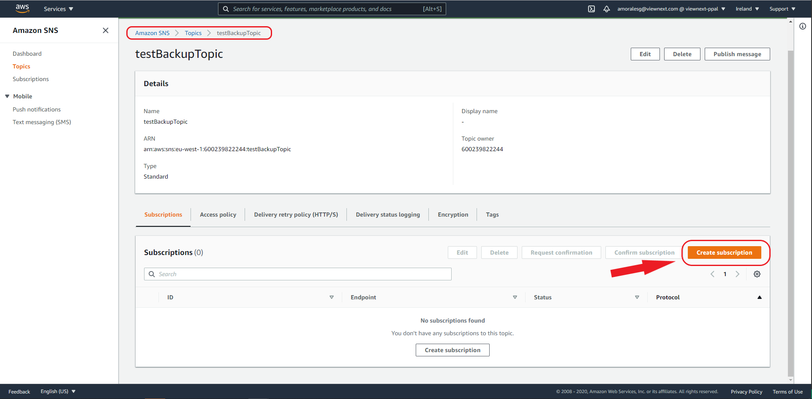

El arn se asigna solo, se elige el tipo de protocolo, en este caso ``Email`` y el `Endpoint` que es el punto final donde acabrá llegando las alertas, nuestro correo.

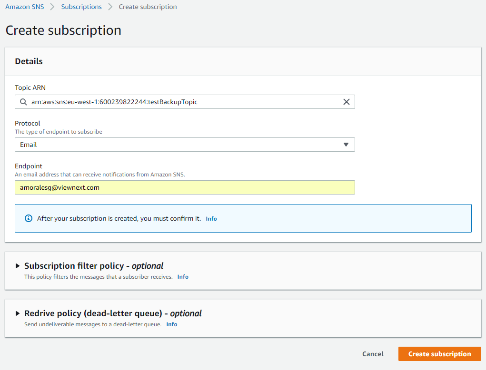

Si el protocolo es de ``Email``, hay que confirmar la subcripción en un correo de confirmación.

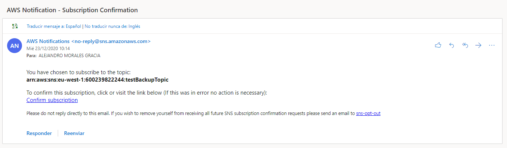

Por último tenemos que ejecutar el siguiente comando en `AWS cli`.

~~~~
aws backup put-backup-vault-notifications \
--backup-vault-name Default \
--sns-topic-arn arn:aws:sns:eu-west-1:600239822244:testBackupTopic \
--backup-vault-events BACKUP_JOB_STARTED BACKUP_JOB_COMPLETED BACKUP_JOB_FAILED 
~~~~